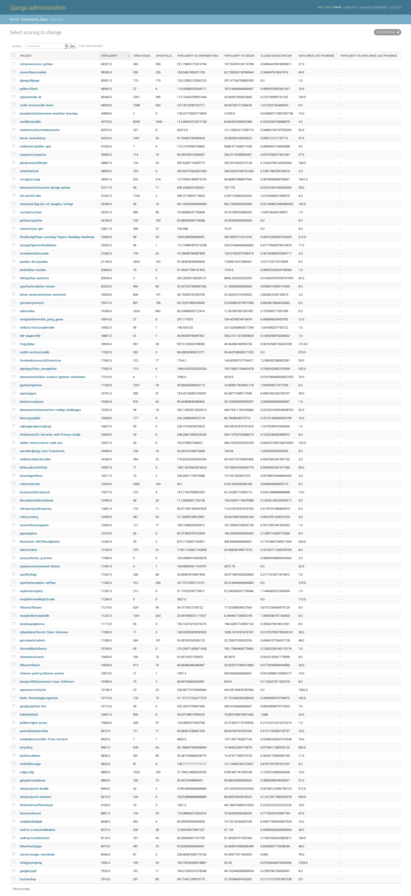

===============================
Python community health metrics
===============================

A database is included.

To view::

    python manage.py runserver

Navigate to ``http://127.0.0.1:8000/admin/`` and login with
``admin/admin1234``.

To fetch data from Github API::

    python manage.py github_health_update

To calculate scoring::

    python manage.py update_scoring

